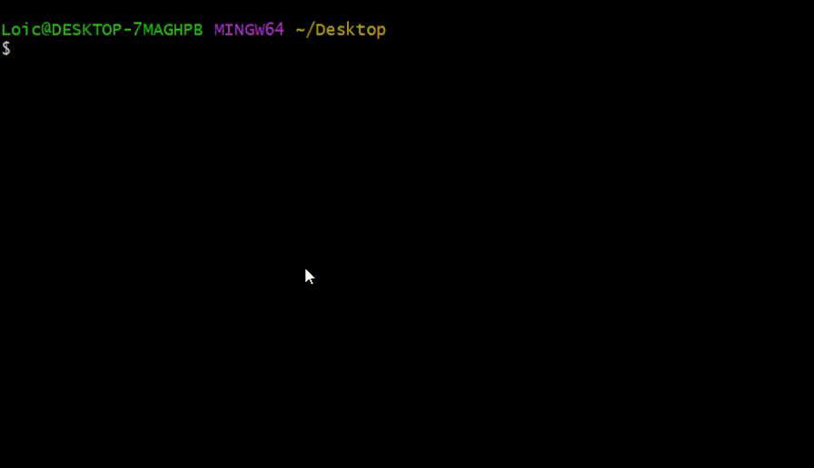

# OC_projet_2_Loic
# Version béta d'un programme de scraping.

La version béta de ce programme permet d'automatiser la récupération des données liées aux livres, depuis le site http://books.toscrape.com/ . 

Le programme récupère puis exportents les informations suivantes au format csv : 

1. Le titre (title)

2. Le prix (price)

3. La note (review_rating)

4. L'url de l'image (image_url)

5. La description (description)

6. Le numéro UPC (UPC)

7. Le type de produit (Product_Type)

8. Le prix HT (Price_excl_tax_)

9. Le prix TTC (Price_incl_tax_)

10. Le montant de la Taxe (Tax)

11. La quantité de livre disponible (number_available)

12. Number_of_reviews

## Pré-requis 

* Python 3 installé ([Télécharger Python](https://www.python.org/downloads/))

## Installation


1. **Téléchargement du projet.**

    

    Depuis votre terminal, placez vous à l'endroit souhaité:
    
    ```cd [chemin d'accès]```  
    
    Creer un nouveau dossier:
    
    ```mkdir [nom de votre dossier]```
    
    Copier le programme source:
    
    ```git clone https://github.com/Lockco/OC_projet_2```
    
    Vous devez voir (depuis votre explorateur) les fichiers suivants:
        * main.py
        * category.py
        * book.py
        * requirements.txt
    
    

2. **Creer un environnement virtuel.**

    Depuis windows/mac/linux: ```python3 -m venv env```
    

3. **Activer l'environnement.**
    
    Depuis windows: ```env\Scripts\activate.bat``` si la commande précèdente ne fonctionne pas essayez ```env\Scripts\activate```
    
    Depuis mac/linux: ```source env/bin/activate```
    
    Si vous rencontrez des difficultés ou si vous souhaitez plus de détails sur l'installation d'un environnement virtuel, vous pouvez vous reporter à la documentation Python:
    
    [Documentation Python](https://docs.python.org/fr/3/library/venv.html?highlight=venv)  
    
4. **Installer les paquets.**

    ```pip install -r requirements.txt```

    En executant la commande: ```pip freeze```, vous devez voir apparaitre cette liste: 

        beautifulsoup4==4.11.1
        certifi==2022.5.18.1
        charset-normalizer==2.0.12
        idna==3.3
        numpy==1.22.4
        pandas==1.4.2
        python-dateutil==2.8.2
        pytz==2022.1
        requests==2.27.1
        six==1.16.0
        soupsieve==2.3.2.post1
        urllib3==1.26.9

    
5. **Lancement du programme**

    ```pyhton __main__.py```

    Lors du démarrage vous aurez le choix entre 3 options :

        1. Extraire les informations des livres : 

            L'option 1 lancera le script et va récupérer les informations de chaque livre par catégorie.

        2. Extraire les couvertures des livres

            L'option 2 lancera le script et récupéra toutes les images depuis la page d'accueil

        3. Quitter l'application

            L'option 3 vous permet de quitter l'application
            
## Fabriqué avec
[Visual Studio Code] (https://code.visualstudio.com/download) - Editeur de textes


